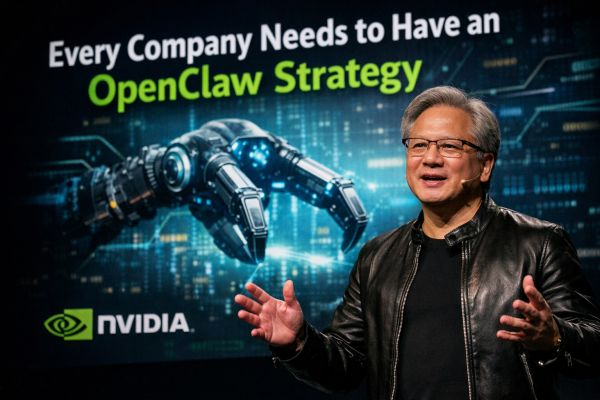

# saras-wingman

  

  <em>"Every Company Needs to Have an OpenClaw Strategy."</em> 
  — Jensen Huang, NVIDIA

---

A collection of Wingman agents built on [Wingman](https://wingman.emergent.sh) by [Emergent Labs](https://emergent.sh) · **#Wingathon · #Vibecon**

---

## Projects

### [Saras — AI Language Coach](./Saras/README.md)

A premium AI language coach that lives inside WhatsApp / Telegram. Voice-first pronunciation scoring, Anki cards, Remotion-rendered vocabulary videos, and plain-English scheduling — all as a single Wingman skill.

**Highlights:** ElevenLabs TTS/STT · Remotion video · SM-2 spaced repetition · personal knowledge base per learner

→ [Read the full Saras README](./Saras/README.md)

---

### [StartupOS — Business Intelligence Fleet](./startup-os/README.md)

A fleet of three Wingman agents for SaaS founders with 1–50 person teams. Covers marketing intelligence, financial operations, and customer retention — sharing signals through a common S3 knowledge bus.

| Agent | Role |
|---|---|
| 🟣 **Ayan** | Intelligence Layer · Marketing Claw |
| 🔵 **Kiyan** | Execution Layer · FinOps Claw |
| 🟢 **Ziyan** | Optimization Layer · Customer Retention Claw |

→ [Read the full StartupOS README](./startup-os/README.md)

---

*Built on [Wingman](https://wingman.emergent.sh) by [Emergent Labs](https://emergent.sh)*
