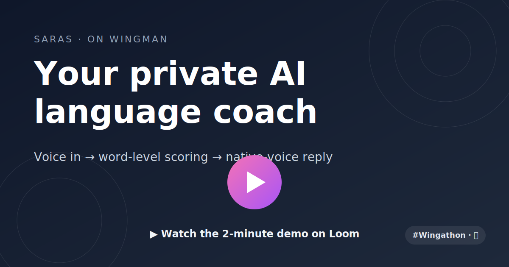
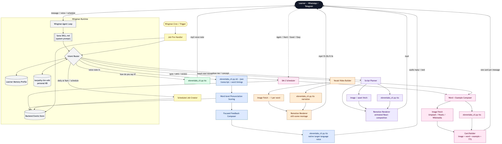

# Saras — on Wingman

> A premium AI language coach that lives inside WhatsApp / Telegram.
> Built as a single skill on [Wingman](https://wingman.emergent.sh) by [Emergent Labs](https://emergent.sh).

**Duolingo can't tell if your pronunciation is actually right. Saras can.**

---

## 🎬 Demo

<p align="center">
  <a href="https://www.loom.com/share/4807b50097b84e46b061e06faf92a933">
    
  </a>
</p>

<p align="center">
  ▶ <a href="https://www.loom.com/share/4807b50097b84e46b061e06faf92a933"><strong>Watch the demo on Loom</strong></a>
</p>

---

## What is Saras?

Saras is a **speaking-first** language coach delivered through the chat app you already use. No app to install, no dashboard to open.

- 🎙 **Voice notes in, native-voice replies out** — word-level pronunciation scoring via ElevenLabs
- 🖼 **Image-first Anki cards** auto-generated from your own mistakes (picture + word + example + TTS)
- 🎥 **Remotion-rendered short videos** (audio + images) for every new-word lesson
- 📅 **Plain-English scheduling** — *"daily vocab at 9pm"* just works
- 🧠 **Personal knowledge base** per learner via `karpathy-llm-wiki`
- 📊 **Owner / admin mode** — engagement summaries, churn-risk alerts, content performance

---

## Architecture

One block diagram, six color-coded flows, all running on the Wingman agent loop.



| Color | Flow | Trigger |
|---|---|---|
| 🟦 Blue | Voice-note pipeline (STT → scoring → TTS) | Learner sends a voice note |
| 🟩 Green | Audio-only explanation | *"how do you say X?"* |
| 🟪 Pink | Anki card — image + word + audio | *"quiz me"*, scheduled cards |
| 🟧 Orange | Vocab video — images + audio | *"teach me new words"* |
| 🟣 Purple | Full Remotion video — animated + audio | *"show me"*, concept video |
| 🟨 Amber | Scheduled delivery | *"daily at 9pm"*, *"weekly recap"* |

📐 **Full architecture walkthrough with the single-block mermaid diagram:** [`architecture/ARCHITECTURE.md`](./architecture/ARCHITECTURE.md)

---

## Repo layout

```
saras-wingman/
├─ wingman/
│  └─ SKILL.md              # the Saras skill — persona, tools, rules (~34 KB markdown)
├─ scripts/
│  └─ elevenlabs.py         # stdlib-only TTS / STT CLI (~12 KB)
├─ architecture/
│  └─ ARCHITECTURE.md       # block diagram + per-flow walkthrough
└─ README.md
```

**Total product surface:** ~46 KB. Wingman does the plumbing.

---

## How it compares to Duolingo

|  | Duolingo | Saras |
|---|---|---|
| Where it lives | Separate app | **WhatsApp / Telegram** |
| Pronunciation feedback | *"try again"* | **Word-level: "'v' in 'very' sounded like 'w' — try voice, visit"** |
| Native voice reply | Generic TTS | **ElevenLabs native voice, cached per learner** |
| Flashcards | Text translation prompts | **Image + target word + example + TTS, from your own mistakes** |
| Daily content | Same lesson for everyone | **Remotion picture-video rotating your weak areas** |
| Scheduling | App push | **Plain-English: "daily vocab at 9pm"** |
| Business use | None | **Owner mode: churn, engagement, content perf** |

---

## Built with

- **Runtime:** [Wingman](https://wingman.emergent.sh) by [Emergent Labs](https://emergent.sh)
- **TTS / STT:** [ElevenLabs](https://elevenlabs.io) (via `scripts/elevenlabs.py`, stdlib only)
- **Video rendering:** [Remotion](https://www.remotion.dev/) (React-based programmatic video)
- **Image sourcing:** Unsplash / Pexels / Wikimedia (royalty-free)
- **Knowledge base:** [`astro-han/karpathy-llm-wiki`](https://github.com/astro-han/karpathy-llm-wiki)
- **Spaced repetition:** SM-2 (in-skill)

---

## License

MIT — do what you want. If you remix Saras into a different language-learning agent, ping [@rajagurunath](https://github.com/rajagurunath) on X and we'll boost it.

Built for **#Wingathon** · #Vibecon
