# Saras on Wingman — Technical Architecture

Saras is an AI language coach that lives inside WhatsApp / Telegram. It runs as a single skill (`wingman/SKILL.md`) on Emergent Labs' **Wingman** agent runtime. There is no mobile app, no dashboard, no custom protocol — every capability is assembled at runtime from three ingredients: the skill prompt, a handful of CLI tools, and the Wingman agent loop.

This document explains how each learner-facing capability is wired, in one block diagram with color-coded flows, followed by a short walkthrough of each flow.

---

## The single block diagram

```mermaid
flowchart TB
    %% ---------- Entry ----------
    U([Learner — WhatsApp / Telegram]):::entry

    %% ---------- Wingman core ----------
    subgraph CORE["Wingman Runtime"]
      direction TB
      WG["Wingman Agent Loop"]:::core
      SK[["Saras SKILL.md<br/>(system prompt)"]]:::core
      RT{"Intent Router"}:::core
      MEM[("Learner Memory Profile")]:::core
      BE[("Backend Events Store")]:::core
      WIKI[("karpathy-llm-wiki<br/>personal KB")]:::core
    end

    U -->|message / voice / schedule| WG
    WG --> SK
    SK --> RT
    RT <--> MEM
    RT <--> WIKI

    %% ---------- Flow 1 : Voice-note pipeline (BLUE) ----------
    RT -->|voice note in| STT["elevenlabs_cli.py stt --json<br/>(transcript + word timings)"]:::voice
    STT --> SCORE["Word-level Pronunciation Scoring"]:::voice
    SCORE --> FB["Focused Feedback Composer"]:::voice
    FB --> TTSv["elevenlabs_cli.py tts<br/>(native target-language voice)"]:::voice
    TTSv -->|"audio reply + text"| U
    SCORE --> BE

    %% ---------- Flow 2 : Audio-only explanation (GREEN) ----------
    RT -->|"'how do you say X?'"| TTSa["elevenlabs_cli.py tts"]:::audio
    TTSa -->|"mp3 voice note"| U

    %% ---------- Flow 3 : Anki card = image + word + audio (PINK) ----------
    RT -->|"quiz / drill / review"| ANKI["SM-2 Scheduler"]:::card
    ANKI --> COMP["Word + Example Composer"]:::card
    COMP --> IMGc["Image Fetch<br/>Unsplash / Pexels / Wikimedia"]:::card
    COMP --> TTSc["elevenlabs_cli.py tts"]:::card
    IMGc --> CARD["Card Builder<br/>image + word + example + TTS"]:::card
    TTSc --> CARD
    CARD -->|"one card per message"| U
    U -.->|"Again / Hard / Good / Easy"| ANKI
    ANKI --> BE

    %% ---------- Flow 4 : Vocab video = images + audio (ORANGE) ----------
    RT -->|"teach new words"| VB["Vocab Video Builder"]:::imgvid
    VB --> COMP
    VB --> IMGv["Image Fetch (1 per word)"]:::imgvid
    VB --> TTSvv["elevenlabs_cli.py tts narration"]:::imgvid
    IMGv --> REMv["Remotion Renderer<br/>still-scene montage"]:::imgvid
    TTSvv --> REMv
    REMv -->|"mp4 15–25s 9:16"| U

    %% ---------- Flow 5 : Full Remotion video = animation + audio (PURPLE) ----------
    RT -->|"'show me' / concept"| SCRIPT["Script Planner"]:::rem
    SCRIPT --> IMGr["Image / asset fetch"]:::rem
    SCRIPT --> TTSr["elevenlabs_cli.py tts"]:::rem
    SCRIPT --> REM["Remotion Renderer<br/>animated React composition"]:::rem
    IMGr --> REM
    TTSr --> REM
    REM -->|"mp4"| U

    %% ---------- Flow 6 : Scheduling (AMBER) ----------
    RT -->|"'daily at 9pm' / schedule intent"| SCHED["Scheduled Job Creator"]:::sch
    SCHED --> BE
    CRON(["Wingman Cron / Trigger"]):::sch --> FIRE["Job Fire Handler"]:::sch
    FIRE --> RT
    FIRE --> BE

    %% ---------- Color classes ----------
    classDef entry  fill:#111827,stroke:#111827,color:#ffffff
    classDef core   fill:#f3f4f6,stroke:#374151,color:#111827
    classDef voice  fill:#dbeafe,stroke:#2563eb,color:#1e3a8a
    classDef audio  fill:#dcfce7,stroke:#16a34a,color:#14532d
    classDef card   fill:#fce7f3,stroke:#db2777,color:#831843
    classDef imgvid fill:#ffedd5,stroke:#ea580c,color:#7c2d12
    classDef rem    fill:#ede9fe,stroke:#7c3aed,color:#4c1d95
    classDef sch    fill:#fef9c3,stroke:#ca8a04,color:#713f12
```

### Color legend

| Color | Flow | Trigger |
|---|---|---|
| 🟦 Blue | **Voice-note pipeline** | Learner sends a voice note |
| 🟩 Green | **Audio-only explanation** | "how do you say / pronounce X?" |
| 🟪 Pink | **Anki card** (image + word + audio) | "quiz me", "drill", "review", scheduled cards |
| 🟧 Orange | **Vocab video** (images + audio, still-scenes) | "teach me new words" — auto-bundles a short clip |
| 🟣 Purple | **Full Remotion video** (animated + audio) | "show me", concept-level "make a video" |
| 🟨 Amber | **Scheduled delivery** | "daily at 9pm", "every night", "weekly recap" |
| ⬜ Gray | **Wingman core** (runtime, skill, router, memory, events, wiki) | Every request passes through |

---

## How each flow works (in a few lines)

### 🟦 Voice-note pipeline

- Learner sends a voice note on WhatsApp / Telegram.
- `elevenlabs_cli.py stt --json` returns transcript + **word-level timestamps**.
- Word timings feed the Scoring step: pronunciation clarity, stress, hesitation, dropped sounds.
- Scores are joined with the learner's history from `MEM` to detect patterns ("you've missed 'r' three times this week").
- Feedback Composer produces 1–3 targeted fixes, an example, and a retry prompt.
- `elevenlabs_cli.py tts` renders the **corrected sentence** in a native-language voice (voice_id cached per-learner in `MEM`).
- Everything is written to `BE` as `voice_note_received`, `pronunciation_scored`, `correction_given`.

### 🟩 Audio-only explanation

- Router detects pronunciation / "say this" intent.
- Direct call to `elevenlabs_cli.py tts "<phrase>" --voice-id <native>` → mp3.
- Delivered as a voice-note bubble, no video, no card.
- Single-hop; this is the fastest path in the system.

### 🟪 Anki card (image + word + audio)

- SM-2 Scheduler picks due cards from `MEM` (prioritised by the learner's own mistakes).
- Word + Example Composer selects target-language word, one natural example sentence, native translation.
- **Image Fetch** — Unsplash / Pexels / Wikimedia, preferring royalty-free photos for concrete nouns; cached URL + attribution is stored with the card.
- `elevenlabs_cli.py tts` renders the word + example clip (auto-attached for new cards and any prior Again/Hard).
- Card Builder assembles **one card per message**: image ▸ front (target word + example) ▸ reveal back (native gloss) ▸ rating prompt.
- Rating ping (Again/Hard/Good/Easy) returns into SM-2 which writes `card_reviewed` and the next `due_next`.

### 🟧 Vocab video (images + audio, still-scenes)

- Triggered automatically when teaching new words — the skill rule is "new vocab always ships with a short picture video".
- Vocab Video Builder requests 3–5 words from the Composer.
- One image fetched per word (same providers as cards, reused when possible).
- `elevenlabs_cli.py tts` narrates each scene: *word → example → word* (built-in spaced repetition inside the clip).
- **Remotion Renderer** stitches image-scene → caption → transliteration → native gloss, each held 3–5s with crossfade, ending with a recap frame.
- Output: mp4, 15–25s, 9:16 vertical, ≤ 10 MB (WhatsApp-safe).
- Delivered with a **task attached** ("send a voice note using any 2 of these words").

### 🟣 Full Remotion video (animated + audio)

- Triggered by "show me / make a video / explain the subjunctive".
- Script Planner writes ≤ 25s of speech in the target language plus a structural plan (intro ▸ example ▸ rule ▸ recap).
- Image / asset fetch brings in supporting visuals where needed (mouth position, conjugation tables, cultural clips).
- `elevenlabs_cli.py tts` renders narration in the learner's cached native voice.
- **Remotion Renderer** runs a proper animated React composition — transitions, animated text, highlighted words in sync with audio word-timings.
- Output: mp4 with captions in both target and native languages.
- Same "task attached" rule: *why this video, what to watch for, one action after*.

### 🟨 Scheduling

- Router detects scheduling intent ("daily at 9pm", "every morning", "weekly recap").
- Opinionated defaults fill in missing fields (type, time, timezone, cadence) from `MEM` — **no clarifying questions** are asked.
- Job is persisted as `scheduled_job` in `BE`.
- Wingman's native cron / trigger fires the job at the scheduled time.
- Job Fire Handler re-enters the Intent Router with the stored payload — so the same card / vocab-video / recap flows run, just initiated by the cron.
- `scheduled_job_fired` is written on delivery. Failed sends are retried once on the next natural check-in (never flooded on reconnect).

---

## Why Wingman makes this easy

Saras is ~34 KB of markdown and a 12 KB Python CLI. That is the entire product surface. This is only possible because Wingman already provides:

- **Messaging transport.** WhatsApp / Telegram in and out are runtime primitives — we never touch the Meta/Twilio API.
- **Skill prompt delivery.** `SKILL.md` is loaded as system context on every turn; no orchestration code needed.
- **Tool invocation.** Any CLI (`elevenlabs_cli.py`, a `remotion render` command, a `curl` to an image host) is directly callable. The skill documents the invocation, the agent runs it.
- **Persistent state.** Learner memory profile + event store are available to the loop between turns, so the skill can reference "last week's mistakes" without building a DB layer.
- **Trust constraints.** Routine actions auto-run; consequential ones (billing, mass sends) ask for approval. We inherit this for free.
- **Native scheduling.** Cron / trigger is a first-class Wingman primitive. "Daily at 9pm" is a one-line job entry, not a cron server we host.
- **Multi-user isolation.** Each learner's `MEM` and `BE` rows are scoped by Wingman's user identity — we don't implement auth.

The skill file does the talking; Wingman does the plumbing. That's why the whole thing fits in a weekend.

---

## Component summary

| Component | Role | Implementation |
|---|---|---|
| **Wingman Agent Loop** | Receives messages, drives turns, invokes tools | Emergent Labs runtime |
| **Saras SKILL.md** | Persona, rules, tool usage, formats | Plain markdown, frontmatter-indexed |
| **Intent Router** | Maps learner text/voice/schedule to a flow | LLM reasoning inside the agent loop |
| **Learner Memory Profile** | Per-user preferences, level, weak sounds, voice_id | Wingman key-value store |
| **Backend Events Store** | Timeseries of every meaningful interaction | Wingman events log (12 event types) |
| **karpathy-llm-wiki** | Long-form personal knowledge base | Markdown repo, one folder per learner |
| **ElevenLabs CLI** | TTS + STT with word timings | `scripts/elevenlabs.py` (stdlib only) |
| **Image Fetch** | Royalty-free pictures for cards + videos | Unsplash / Pexels / Wikimedia APIs |
| **Remotion Renderer** | React-based programmatic video | `remotion render` CLI, still + animated compositions |
| **SM-2 Scheduler** | Spaced-repetition intervals for Anki cards | In-skill algorithm, state in Memory |
| **Scheduled Job Creator / Fire Handler** | Recurring deliveries | Wingman cron primitive |
