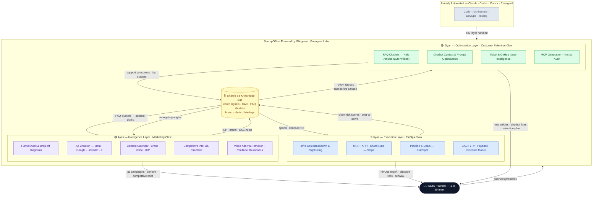

# StartupOS — by Wingman

> **Coding is solved. Claude, Codex, Cursor, Emergent — they build your product.**
> **StartupOS solves everything else.**

For a SaaS founder with a team of 1 to 50, the hardest problems are never the code. They are:
- *"Why are users churning and what do I say to win them back?"*
- *"Are we going to be profitable next quarter?"*
- *"What are our customers actually confused about — and where is it costing us?"*

StartupOS is a fleet of three Wingman agents — each an expert operator, each aware of the others — running autonomously inside your messaging stack and sharing intelligence through a common knowledge bus.

No dashboards to babysit. No agencies to brief. Three agents, one founder, full-stack business intelligence.

---

## The Fleet



---

## The Agents

### 🟣 Ayan — Intelligence Layer · Marketing Claw

The marketing brain. Ayan researches, plans, creates, and distributes — from ad copy to competitor teardowns to 30-day content calendars. It reads churn signals from Kiyan to retarget at-risk segments and reads Ziyan's FAQ clusters to turn support pain into content.

**Skills:** `remotion` · `karpathy-llm-wiki` · `audio` · `firecrawl/cli` · `youtube-thumbnail-design` · `content-strategy` · `marketing-ideas`

**Ask Ayan:**

> 1. *"Ayan, which stage of our funnel is bleeding the most money — and what's the fix?"*
> 2. *"Ayan, our competitor just dropped their price. Give me the ad, the landing page angle, and the positioning shift."*
> 3. *"Ayan, create a Meta retargeting campaign for our churned users from last quarter."*
> 4. *"Ayan, what content should we publish this week based on what customers are confused about?"*

---

### 🔵 Kiyan — Execution Layer · FinOps Claw

The financial operator. Kiyan tracks every dollar in (MRR, deals, upgrades) and out (infra, CAC, tooling), scores every customer for churn risk, and models discount offers before they cancel. It feeds Ziyan the churn-risk list daily so retention actions happen before the customer even thinks about leaving.

**Skills:** `kwall1/hubspot` · `stripe-best-practices` · `db` · `karpathy-llm-wiki`

**Ask Kiyan:**

> 1. *"Kiyan, if churn stays at its current rate — when do we run out of runway?"*
> 2. *"Kiyan, which 3 customers should we call today before they cancel, and what should we offer them?"*
> 3. *"Kiyan, we spent $14k on ads last month. What's the ROI by channel?"*
> 4. *"Kiyan, find me $2k in monthly infra savings without breaking anything."*

---

### 🟢 Ziyan — Optimization Layer · Customer Retention Claw

The customer intelligence engine. Ziyan listens to every signal — tickets, chats, GitHub issues, docs behaviour — surfaces the patterns, and then acts: writes the help article, rewrites the chatbot prompt, generates the MCP, audits the llms.txt. It picks up Kiyan's daily churn-risk list and drafts a personalised intervention for each at-risk customer before they contact support.

**Skills:** `db` · `amplitude` · `github-mcp` · `freshservice_mcp` · `docs-coauthoring` · `karpathy-llm-wiki`

**Ask Ziyan:**

> 1. *"Ziyan, what are customers most confused about this week — and write the help article now."*
> 2. *"Ziyan, our chatbot CSAT dropped to 3.2. What's breaking and fix it."*
> 3. *"Ziyan, which GitHub issues are making customers the angriest — and which should engineering prioritise?"*
> 4. *"Ziyan, generate an MCP so customers can self-serve their own billing queries."*

---

## How the Agents Talk to Each Other

The three agents share a common S3 knowledge bus. Each writes its outputs on schedule; each reads what it needs. No manual handoffs.

```
Every Monday
  Ayan  → publishes weekly marketing brief to shared bus
  Kiyan → reads Ayan's CAC data; adjusts budget recommendation
  Ziyan → reads Ayan's ICP; personalises help content by segment

Every day
  Kiyan → scores every customer for churn risk; writes to shared bus
  Ziyan → reads churn-signal file; drafts proactive intervention per at-risk customer

When MRR drops > 5% week-over-week
  Kiyan → writes alert to shared bus
  Ayan  → reads alert; adjusts spend; prepares win-back campaign
  Ziyan → reads alert; prioritises at-risk ticket triage immediately
```

---

## Why Now

| Layer | What's automated today | What StartupOS automates |
|---|---|---|
| **Code** | Claude · Codex · Cursor · Emergent | — |
| **Marketing** | Agencies · freelancers · guesswork | **Ayan** |
| **Finance & FinOps** | Spreadsheets · quarterly reviews | **Kiyan** |
| **Customer Retention** | Manual support · hope | **Ziyan** |

A 5-person SaaS team now has a marketing director, a CFO, and a VP of Customer Success — operating 24/7, sharing intelligence, and getting smarter with every interaction.

---

## Repo Structure

```
startup-os/
├─ README.md                      ← you are here
├─ ayan-marketing/
│  └─ wingman/SKILL.md            ← load into Wingman to create Ayan
├─ kiyan-finops/
│  └─ wingman/SKILL.md            ← load into Wingman to create Kiyan
└─ ziyan-retention/
   └─ wingman/SKILL.md            ← load into Wingman to create Ziyan
```

## Skills to Install Before Going Live

```bash
# Kiyan — FinOps
openclaw install kwall1/hubspot
openclaw install stripe/ai/skills/stripe-best-practices

# Ziyan — Retention
openclaw install mrgoodb/amplitude
openclaw install effytech/freshservice_mcp
```

---

*Built on [Wingman](https://wingman.emergent.sh) by [Emergent Labs](https://emergent.sh) · #Wingathon · #Vibecon*
